# 🤑 MEEWANGLOAN

## 팀 소개

<table border>
  <tbody>
    <tr>
      <td align="center" width="200px">
         
        팀장 FE. 
        
      </td>
      <td align="center" width="200px">
         
        팀원 FE. 
        
      </td>
      <td align="center" width="200px">
        
        팀원 FE. 
        
      </td>
      <td align="center" width="200px">
        
        팀원 FE. 
        
      </td>
     </tr>
  </tbody>
</table>

## [MEEWANGLOAN DEMO](https://meewangloan.netlify.app/)

## 📅 과제 기간 및 담당 업무

- 과제 기간: 2023. 02. 08 ~

- **조민정**: 마이 페이지 | 검색 페이지
- **곽혜지**: 장바구니 페이지 | 로딩 페이지
- **조승후**: 메인 페이지 | 로그인 상태 유지
- **조효림**: 로그인 / 회원가입 페이지 | 상품 상세 페이지

## ✏️ 기술 스택

  
  
  
  
  
  
  
  

## 🛒 서비스 소개

### 로딩 페이지

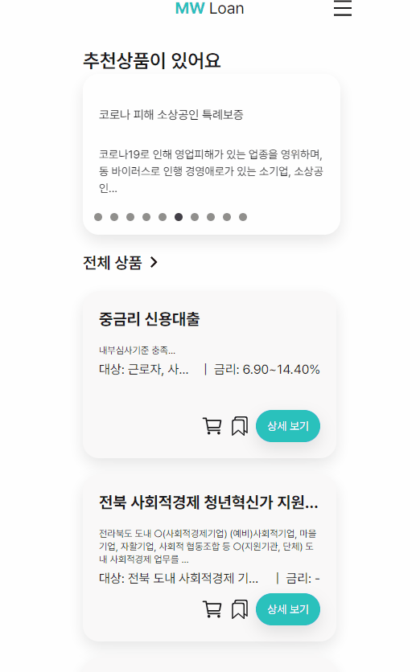

### 메인 페이지

로그인 안 한 상태  
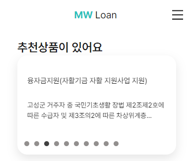  
로그인 한 상태  
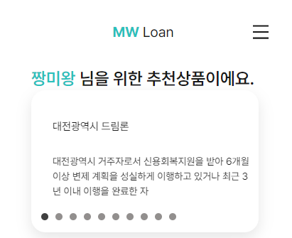 
검색  
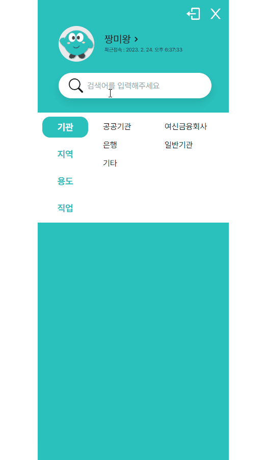 
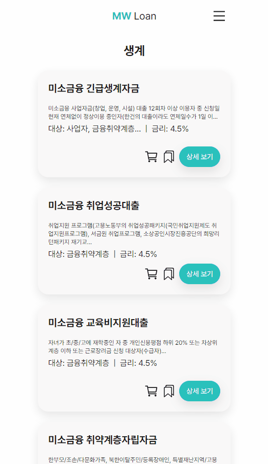

### 전체 상품 페이지

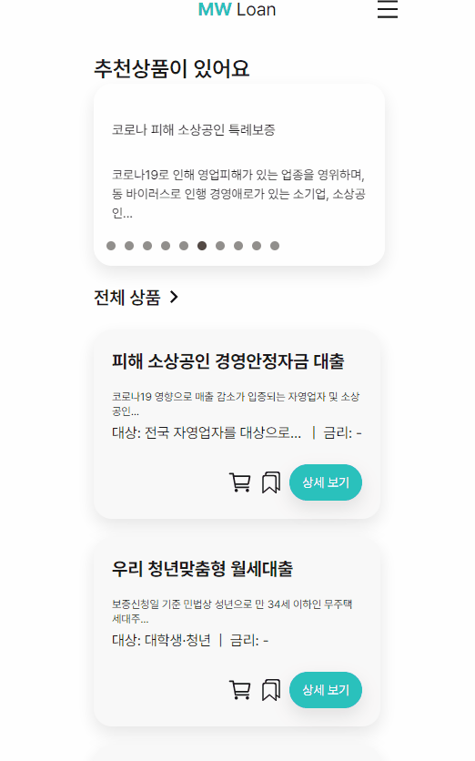

### 카테고리 별 페이지

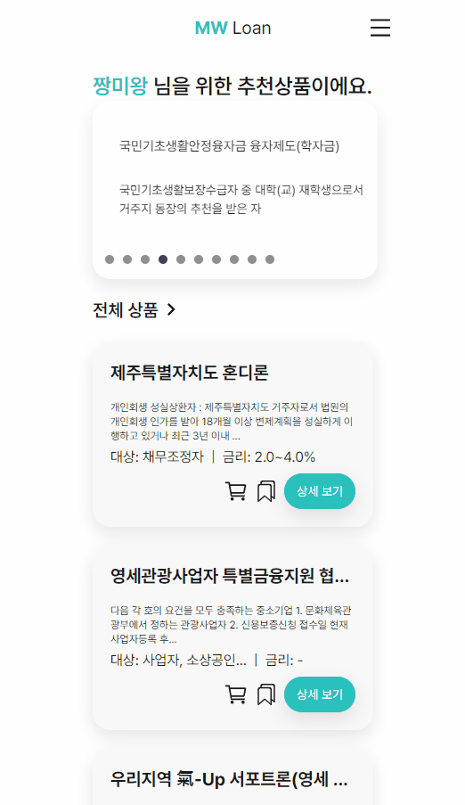

### 마이 페이지

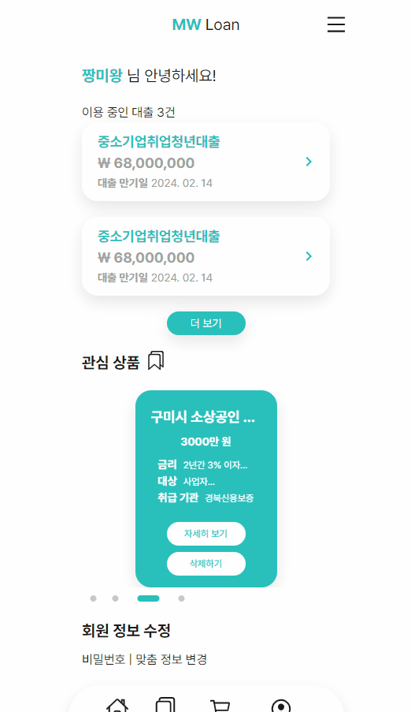
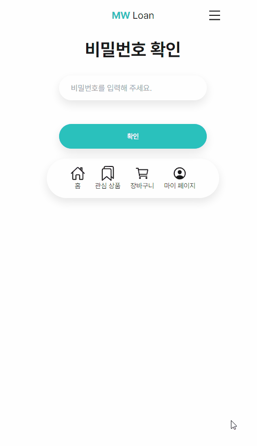

### 장바구니 페이지

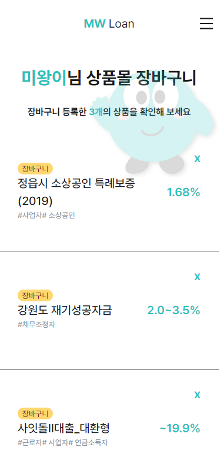

### 상세 페이지

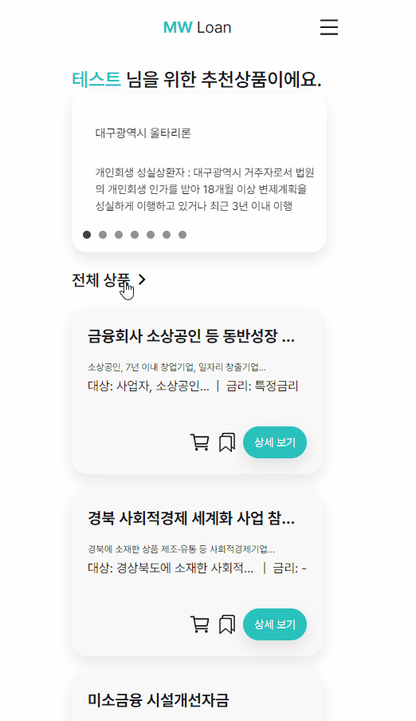

## 🧐 개선할 점

- 조민정

  - 아쉬운 부분  
    리덕스를 활용하여 상태 관리를 하는 부분이 많이 부족하여 리덕스 관련 코드는 참여가 어려웠다. 다른 팀원이 작성한 코드를 보면서 코드의 흐름은 익혔지만 스스로 작성하는 부분에선 어려울 듯  
    사용자의 입장에서 생각을 하고 페이지의 흐름을 짜고 싶었는데 촉박한 시간으로 인해서 기능 개발에만 신경을 쓴 것이 아쉽다. 사용자 입장에서 사소한 에러들을 찾는 게 어렵다. 다양한 케이스를 접해 보고 싶다  
    모바일 사이즈로 진행한 건 처음이라 모바일 사이즈에 맞추기가 어려웠다. 기종마다 사이즈가 달라서 유연하게 사용할 수 있도록 미디어 쿼리를 사용했으면 좋았을 것 같다  
    백엔드나, 같은 팀원 간 소통이 여전히 어려운 것 같다 백엔드가 생각한 페이지 흐름과 프론트가 생각한 흐름이 다르거나 프론트 팀 사이에서도 서로 설계를 하거나 코드를 작성하는 방식이 다를 때 함께 잘 맞추어 가고 싶다  
  - 더 개발하고 싶은 부분  
  검색 페이지에서 무한 스크롤 사용하기 (상품 리스트 부분)  
  새로고침을 해야 유저의 정보를 가지고 오거나, 로그인 상태를 확인할 수 있는 부분  
  실제 서비스였다면 관리자 페이지를 만들어서 상품 리스트를 수정할 수 있었으면 좋을 듯
  

- 곽혜지

  - 아쉬웠던 부분  
    Toast를 사용하여 장바구니를 만들었으면 더 좋았을 듯.  
    User정보를 다루는 코드를 개선해서 custom hook을 적극 활용했으면 좋았을것 같은 아쉬움이 남음.  
    실제로 대출 상품을 결제하는 절차가 없던 것.  
    짧은 시간에 개발하려고 하다보니 사용자 입장에서 좀 더 깊게 고민해보고 단계별로 어떤것이 필요한지 더 세밀하게보지 못했던 것.  
    EX) 혜지 - 노션 페이지  

    - 장바구니 카트 추가.

    * 메인페이지 장바구니 카트 추가 버튼 생성.
    * 버튼 클릭시 서버에 장바구니 추가 요청.
    * 리덕스 장바구니 추가.  
      => 리덕스와 서버에서 장바구니 카트 추가됨.  
      => 기존에 있던 장바구니 추가 버튼은 어떻게 할 것인가?  

    1.  없앤다.
    2.  삭제버튼으로 변경한다. -> 빨간하트가 되었을 때 누르면 장바구니 취소.
        버튼 클릭 시 서버에 장바구니 삭제 요청.
        리덕스 장바구니 삭제 요청.

  - 더 개발하고 싶은 부분  
    Tosast를 사용해서 장바구니 삭제 피드백 만들기.  
    모달창으로 로그인 로그아웃 구현해보기.  
    UX를 고려하여 가독성, 심미성 높은 UI로 바꾸기.  
    CreateAsyncThunk를 통해서 로딩상태와 데이터를 모두 다룰 수 있도록 변경하고 싶다.
  - 어려웠던 부분  
  백앤드에 직접 api 요구사항을 요청하고, 백엔드가 작업 중인 상태에서 동시에 프론트엔드를 작업하는 것이 어려웠다.  
  Redux와 createAsyncThunk를 활용해서 비동기로 상태 관리하는 것이 어려웠다.
  

- 조승후

  - 아쉬운 부분  
    새로고침 없이 로그인한 유저의 정보 가져오기..

  - 더 개발하고 싶은 부분  
    찜목록에 있는 상품이면 찜버튼 색깔 바꾸기
  - 어려웠던 부분  
  백엔드와의 연계 시 다양한 질문하기…  
  타입스크립트 자체가 너무 어려웠다.  
  redux를 활용해서 상태관리하는 것이 생각보다 이해하는데 시간이 오래 걸렸다
  

- 조효림
  - 아쉬운 부분
    - 처음에 생각했던 디자인과 조금 달라진 css
    - 다양한 오류에 대한 처리 방식
    - 상세 정보 페이지에서 정보가 없을 시의 화면 구현
    - 컴포넌트 재사용
  - 더 개발하고 싶은 부분
    - 토스티파이가 아닌 서비스에 좀 더 어울리는 귀여운 모달창
    - 페이지간 좀 더 매끄러운 연결
    - 사용자에게 더 쉬운 인터페이스
  - 어려웠던 부분
    - 서버에서 각종 에러들이 나타내는 것을 정확히 이해하지 못했던 점
    - 타입스크립트 적용
    - 구성원들과 스타일 통일하기
    - api 함수의 관리
    - axios interceptor 의 사용

- 토큰이 만료되었을 때 자동으로 로그아웃이 되지 않습니다.
- 로그인을 했을 때 새로고침을 해 줘야만 해당 유저에 관한 정보값이 들어오게 되었습니다.
- 결제 기능이 없어서 이용 중인 대출에 대한 부분은 하드 코딩 되어 있습니다.
- 정적 파일을 이용하는 방식 때문에 로딩 페이지에서 배경이 사라지는 오류가 있습니다.
